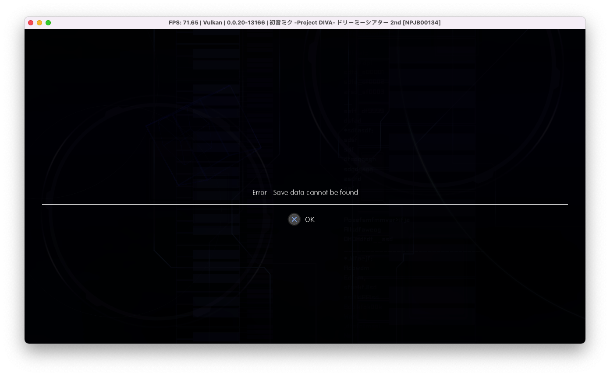

# pddt2ndex
Project Diva Dreamy Theater 2nd and Extend Save File

## How to import savefile to RPCS3?
- First, launch the game and create a save file there
- Close the game
- Go to `~/Library/Application Support/rpcs3/dev_hdd0/savedata`
- Replace the `SYSTEM.DAT` for each games, or just replace the whole folder

## Common Error

1. Save data cannot be found
    - Press OK
    - And create a new save data
    - Close the game
    - Replace `SYSTEM.DAT` to the correct game
    - Relaunch
    